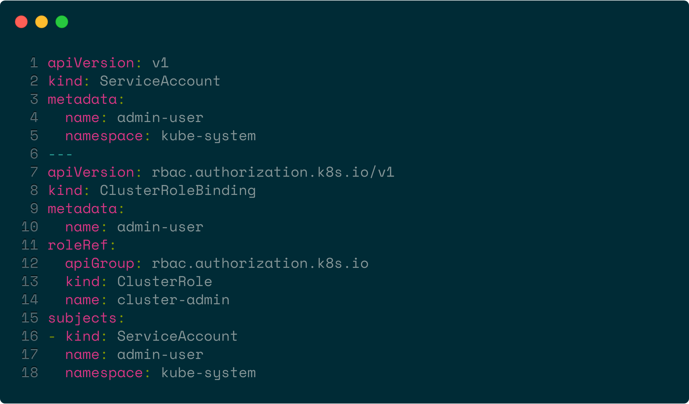

# Documentation

## Pre-requisites
Before beginning, you must generate a bearer token for the Ruby Kubernetes Controller to use:


1. Save the following as `serviceaccount.yaml` (file available [here][SERVICEACCOUNT])
    <p align="center"></p>
2. Run the following in a terminal, with `kubectl` pre-configured for your existing cluster
    ```bash
    $ kubectl apply -f serviceaccount.yaml
    $ kubectl -n kube-system describe secret $(kubectl -n kube-system get secret | grep admin-user | awk '{print $1}')
    ```
3. Copy down your bearer token
4. You can get your endpoint by running `kubectl cluster-info`

###### Source: https://github.com/kubernetes/dashboard/wiki/Creating-sample-user
#### Get Nodes
* List all nodes
```ruby
    require 'ruby-kubernetes-controller'
    
    endpoint = "localhost"
    bearer_token = "token"
    ssl = false
    
    client = ::RubyKubernetesController::Client.new(endpoint, bearer_token, ssl)
    
    puts client.get_nodes # Returns JSON
```
#### Create Namespace
* Create new Namespace
* Config options documentation available at: https://kubernetes.io/docs/reference/federation/v1/definitions/#_v1_namespace
```ruby
    require 'ruby-kubernetes-controller'
    
    endpoint = "localhost"
    bearer_token = "token"
    ssl = false
    
    # With JSON
    json_client = ::RubyKubernetesController::Client.new(endpoint, bearer_token, ssl, yaml = false)
    json_config = 
    '{
        "kind": "Namespace",
        "apiVersion": "v1",
         ... 
     }'    
    
    puts json_client.create_new_namespace(json_config) # Returns JSON
    
    # With YAML
    yaml_client = ::RubyKubernetesController::Client.new(endpoint, bearer_token, ssl, yaml = true)
    yaml_file_path = '/path/to/file.yaml'    
        
    puts yaml_client.create_new_namespace(yaml_file_path) # Returns JSON
```

#### Get Namespaces
* List all Namespaces
```ruby
    require 'ruby-kubernetes-controller'
    
    endpoint = "localhost"
    bearer_token = "token"
    ssl = false
    
    client = ::RubyKubernetesController::Client.new(endpoint, bearer_token, ssl)
    
    puts client.get_all_namespaces # Returns JSON
```

#### Update Namespace
* Update existing Namespace
* Update options documentation available at: https://kubernetes.io/docs/reference/federation/v1/definitions/#_v1_namespace
```ruby
    require 'ruby-kubernetes-controller'
    
    endpoint = "localhost"
    bearer_token = "token"
    ssl = false
    
    # With JSON
    json_client = ::RubyKubernetesController::Client.new(endpoint, bearer_token, ssl, yaml = false)
    namespace = "default"
    json_update = 
    '{
        "kind": "Namespace",
        "apiVersion": "v1",
         ... 
     }'    
    
    puts json_client.update_namespace(namespace, json_update) # Returns JSON
    
    # With YAML
    yaml_client = ::RubyKubernetesController::Client.new(endpoint, bearer_token, ssl, yaml = true)
    namespace = "default"
    yaml_file_path = '/path/to/file.yaml'
        
    puts yaml_client.update_namespace(namespace, yaml_file_path) # Returns JSON
```

#### Patch Namespace
* Patch existing Namespace
* Patch Format documentation available at: http://jsonpatch.com/
```ruby
    require 'ruby-kubernetes-controller'
    
    endpoint = "localhost"
    bearer_token = "token"
    ssl = false
    
    client = ::RubyKubernetesController::Client.new(endpoint, bearer_token, ssl)
    
    namespace = "default"
    patch = 
    '[
      { "op": "replace", "path": "/baz", "value": "boo" },
      { "op": "add", "path": "/hello", "value": ["world"] },
      { "op": "remove", "path": "/foo" }
    ]'    
    
    puts client.patch_namespace(namespace, patch) # Returns JSON
```

#### Delete Namespace
* Delete existing Namespace
* Delete options documentation available at: https://kubernetes.io/docs/reference/federation/v1/definitions/#_v1_deleteoptions
```ruby
    require 'ruby-kubernetes-controller'
    
    endpoint = "localhost"
    bearer_token = "token"
    ssl = false
    
    # With JSON
    json_client = ::RubyKubernetesController::Client.new(endpoint, bearer_token, ssl, yaml = false)
    namespace = "default"
    json_options = 
    '{
        "kind": "Namespace",
        "apiVersion": "v1",
         ... 
     }'    
    
    puts json_client.delete_namespace(namespace, json_options) # Returns JSON
    
    # With YAML
    yaml_client = ::RubyKubernetesController::Client.new(endpoint, bearer_token, ssl, yaml = true)
    namespace = "default"
    yaml_file_path = 'path/to/file.yaml'  
    
    puts yaml_client.delete_namespace(namespace, yaml_file_path) # Returns JSON
```

#### Create Ingress
* Create new Ingress
* Config options documentation available at: https://kubernetes.io/docs/reference/federation/extensions/v1beta1/definitions/#_v1beta1_ingress
```ruby
    require 'ruby-kubernetes-controller'
    
    endpoint = "localhost"
    bearer_token = "token"
    ssl = false
    
    # With JSON
    json_client = ::RubyKubernetesController::Client.new(endpoint, bearer_token, ssl, yaml = false)
    namespace = "default"
    json_config = 
    '{
        "kind": "Ingress",
        "apiVersion": "extensions/v1beta1",
         ... 
     }'   
    
    puts json_client.create_new_ingress(namespace, json_config) # Returns JSON
    
    # With YAML
    yaml_client = ::RubyKubernetesController::Client.new(endpoint, bearer_token, ssl, yaml = true)
    namespace = "default"
    yaml_file_path = 'path/to/file.yaml'
    
    puts yaml_client.create_new_ingress(namespace, yaml_file_path) # Returns JSON
```

#### Get Ingresses
* List all Ingresses
```ruby
    require 'ruby-kubernetes-controller'
    
    endpoint = "localhost"
    bearer_token = "token"
    ssl = false
    
    client = ::RubyKubernetesController::Client.new(endpoint, bearer_token, ssl)
    
    puts client.get_all_ingresses # Returns JSON
```

#### Get Namespaced Ingresses
* List all existing Ingresses in Namespace
```ruby
    require 'ruby-kubernetes-controller'
    
    endpoint = "localhost"
    bearer_token = "token"
    ssl = false
    
    client = ::RubyKubernetesController::Client.new(endpoint, bearer_token, ssl)
    
    namespace = "default"
    
    puts client.get_all_namespaced_ingresses(namespace) # Returns JSON
```

#### Get Single Namespaced Ingress
* Get details for single Ingress in Namespace
```ruby
    require 'ruby-kubernetes-controller'
    
    endpoint = "localhost"
    bearer_token = "token"
    ssl = false
    
    client = ::RubyKubernetesController::Client.new(endpoint, bearer_token, ssl)
    
    namespace = "default"
    ingress_name = "ingress"
    
    puts client.get_single_namespaced_ingress(namespace, ingress_name) # Returns JSON
```

#### Update Ingress
* Update existing Ingress in Namespace
* Update options documentation available at: https://kubernetes.io/docs/reference/federation/extensions/v1beta1/definitions/#_v1beta1_ingress
```ruby
    require 'ruby-kubernetes-controller'
    
    endpoint = "localhost"
    bearer_token = "token"
    ssl = false
    
    # With JSON
    json_client = ::RubyKubernetesController::Client.new(endpoint, bearer_token, ssl, yaml = false)
    namespace = "default"
    ingress_name = "ingress"
    json_update = 
    '{
        "kind": "Ingress",
        "apiVersion": "extensions/v1beta1",
         ... 
     }'    
    
    puts json_client.update_namespaced_ingress(namespace, ingress_name, json_update) # Returns JSON
    
    # With YAML
    yaml_client = ::RubyKubernetesController::Client.new(endpoint, bearer_token, ssl, yaml = true)
    namespace = "default"
    ingress_name = "ingress"
    yaml_file_path = 'path/to/file.yaml'
    
    puts yaml_client.update_namespaced_ingress(namespace, ingress_name, yaml_file_path) # Returns JSON
```

#### Patch Ingress
* Patch existing Ingress
* Patch Format documentation available at: http://jsonpatch.com/
```ruby
    require 'ruby-kubernetes-controller'
    
    endpoint = "localhost"
    bearer_token = "token"
    ssl = false
    
    client = ::RubyKubernetesController::Client.new(endpoint, bearer_token, ssl)
    
    namespace = "default"
    ingress_name = "ingress"
    patch = 
    '[
      { "op": "replace", "path": "/baz", "value": "boo" },
      { "op": "add", "path": "/hello", "value": ["world"] },
      { "op": "remove", "path": "/foo" }
    ]'    
    
    puts client.patch_ingress(namespace, ingress_name, patch) # Returns JSON
```

#### Delete Ingress
* Delete existing Ingress
* Delete options documentation available at: https://kubernetes.io/docs/reference/federation/v1/definitions/#_v1_deleteoptions
```ruby
    require 'ruby-kubernetes-controller'
    
    endpoint = "localhost"
    bearer_token = "token"
    ssl = false
    
    # With JSON
    json_client = ::RubyKubernetesController::Client.new(endpoint, bearer_token, ssl, yaml = false)
    namespace = "default"
    ingress_name = "ingress"
    json_options = 
    '{
        "kind": "Ingress",
        "apiVersion": "extensions/v1beta1",
         ... 
     }'    
    
    puts json_client.delete_ingress(namespace, ingress_name, json_options) # Returns JSON
    
    # With YAML
    yaml_client = ::RubyKubernetesController::Client.new(endpoint, bearer_token, ssl, yaml = true)
    namespace = "default"
    ingress_name = "ingress"
    yaml_file_path = 'path/to/file.yaml'
    
    puts yaml_client.delete_ingress(namespace, ingress_name, yaml_file_path) # Returns JSON
```

#### Create Endpoint
* Create new Endpoint
* Config options documentation available at: https://kubernetes.io/docs/reference/federation/v1/definitions/#_v1_service
```ruby
    require 'ruby-kubernetes-controller'
    
    endpoint = "localhost"
    bearer_token = "token"
    ssl = false
    
    # With JSON
    json_client = ::RubyKubernetesController::Client.new(endpoint, bearer_token, ssl, yaml = false)
    namespace = "default"
    json_config = 
    '{
        "kind": "Endpoints",
        "apiVersion": "v1",
         ... 
     }'   
    
    puts json_client.create_new_endpoint(namespace, json_config) # Returns JSON
    
    # With YAML
    yaml_client = ::RubyKubernetesController::Client.new(endpoint, bearer_token, ssl, yaml = true)
    namespace = "default"
    yaml_file_path = 'path/to/file.yaml'
  
    puts yaml_client.create_new_endpoint(namespace, yaml_file_path) # Returns JSON
```

#### Get Endpoints
* List all Endpoints
```ruby
    require 'ruby-kubernetes-controller'
    
    endpoint = "localhost"
    bearer_token = "token"
    ssl = false
    
    client = ::RubyKubernetesController::Client.new(endpoint, bearer_token, ssl)
    
    puts client.get_all_endpoints # Returns JSON
```

#### Get Namespaced Endpoints
* List all existing Endpoints in Namespace
```ruby
    require 'ruby-kubernetes-controller'
    
    endpoint = "localhost"
    bearer_token = "token"
    ssl = false
    
    client = ::RubyKubernetesController::Client.new(endpoint, bearer_token, ssl)
    
    namespace = "default"
    
    puts client.get_all_namespaced_endpoints(namespace) # Returns JSON
```

#### Get Single Namespaced Endpoint
* Get details for single Endpoint in Namespace
```ruby
    require 'ruby-kubernetes-controller'
    
    endpoint = "localhost"
    bearer_token = "token"
    ssl = false
    
    client = ::RubyKubernetesController::Client.new(endpoint, bearer_token, ssl)
    
    namespace = "default"
    endpoint_name = "endpoint"
    
    puts client.get_single_namespaced_endpoint(namespace, endpoint_name) # Returns JSON
```

#### Update Endpoint
* Update existing Endpoint in Namespace
* Update options documentation available at: https://kubernetes.io/docs/reference/federation/v1/definitions/#_v1_service
```ruby
    require 'ruby-kubernetes-controller'
    
    endpoint = "localhost"
    bearer_token = "token"
    ssl = false
    
    # With JSON
    json_client = ::RubyKubernetesController::Client.new(endpoint, bearer_token, ssl, yaml = false)
    namespace = "default"
    endpoint_name = "endpoint"
    json_update = 
    '{
        "kind": "Endpoints",
        "apiVersion": "v1",
         ... 
     }'    
    
    puts json_client.update_namespaced_endpoint(namespace, endpoint_name, json_update) # Returns JSON
    
    # With YAML
    yaml_client = ::RubyKubernetesController::Client.new(endpoint, bearer_token, ssl, yaml = true)
    namespace = "default"
    endpoint_name = "endpoint"
    yaml_file_path = 'path/to/file.yaml'
    
    puts yaml_client.update_namespaced_endpoint(namespace, endpoint_name, yaml_file_path) # Returns JSON
```

#### Patch Endpoint
* Patch existing Endpoint
* Patch Format documentation available at: http://jsonpatch.com/
```ruby
    require 'ruby-kubernetes-controller'
    
    endpoint = "localhost"
    bearer_token = "token"
    ssl = false
    
    client = ::RubyKubernetesController::Client.new(endpoint, bearer_token, ssl)
    
    namespace = "default"
    endpoint_name = "endpoint"
    patch = 
    '[
      { "op": "replace", "path": "/baz", "value": "boo" },
      { "op": "add", "path": "/hello", "value": ["world"] },
      { "op": "remove", "path": "/foo" }
    ]'    
    
    puts client.patch_endpoint(namespace, endpoint_name, patch) # Returns JSON
```

#### Delete Endpoint
* Delete existing Endpoint
* Delete options documentation available at: https://kubernetes.io/docs/reference/federation/v1/definitions/#_v1_deleteoptions
```ruby
    require 'ruby-kubernetes-controller'
    
    endpoint = "localhost"
    bearer_token = "token"
    ssl = false
    
    # With JSON
    json_client = ::RubyKubernetesController::Client.new(endpoint, bearer_token, ssl, yaml = false)
    namespace = "default"
    endpoint_name = "endpoint"
    json_options = 
    '{
        "kind": "Endpoints",
        "apiVersion": "v1",
         ... 
     }'    
    
    puts json_client.delete_endpoint(namespace, endpoint_name, json_options) # Returns JSON
    
    # With YAML
    yaml_client = ::RubyKubernetesController::Client.new(endpoint, bearer_token, ssl, yaml = true)
    namespace = "default"
    endpoint_name = "endpoint"
    yaml_file_path = 'path/to/file.yaml'
    
    puts yaml_client.delete_endpoint(namespace, endpoint_name, yaml_file_path) # Returns JSON
```

#### Create Pod
* Create new Pod
* Config options documentation available at: https://kubernetes.io/docs/reference/federation/v1/definitions/#_v1_service
```ruby
    require 'ruby-kubernetes-controller'
    
    pod = "localhost"
    bearer_token = "token"
    ssl = false
    
    # With JSON
    json_client = ::RubyKubernetesController::Client.new(pod, bearer_token, ssl, yaml = false)
    namespace = "default"
    json_config = 
    '{
        "kind": "Pod",
        "apiVersion": "v1",
         ... 
     }'   
    
    puts json_client.create_new_pod(namespace, json_config) # Returns JSON
    
    # With YAML
    yaml_client = ::RubyKubernetesController::Client.new(pod, bearer_token, ssl, yaml = true)
    namespace = "default"
    yaml_file_path = 'path/to/file.yaml'
    
    puts yaml_client.create_new_pod(namespace, yaml_file_path) # Returns JSON
```

#### Get Pods
* List all Pods
```ruby
    require 'ruby-kubernetes-controller'
    
    pod = "localhost"
    bearer_token = "token"
    ssl = false
    
    client = ::RubyKubernetesController::Client.new(pod, bearer_token, ssl)
    
    puts client.get_all_pods # Returns JSON
```

#### Get Namespaced Pods
* List all existing Pods in Namespace
```ruby
    require 'ruby-kubernetes-controller'
    
    pod = "localhost"
    bearer_token = "token"
    ssl = false
    
    client = ::RubyKubernetesController::Client.new(pod, bearer_token, ssl)
    
    namespace = "default"
    
    puts client.get_all_namespaced_pods(namespace) # Returns JSON
```

#### Get Namespaced Pods With Field Selector
* List all existing Pods in Namespace that have a specific field selector
```ruby
    require 'ruby-kubernetes-controller'
    
    pod = "localhost"
    bearer_token = "token"
    ssl = false
    
    client = ::RubyKubernetesController::Client.new(pod, bearer_token, ssl)
    
    namespace = "default"
    
    puts client.get_all_namespaced_pods_with_field_selector(namespace, field_selector) # Returns JSON
```

#### Get Namespaced Pods With Label Selector
* List all existing Pods in Namespace that have a specific label selector
```ruby
    require 'ruby-kubernetes-controller'
    
    pod = "localhost"
    bearer_token = "token"
    ssl = false
    
    client = ::RubyKubernetesController::Client.new(pod, bearer_token, ssl)
    
    namespace = "default"
    
    puts client.get_all_namespaced_pods_with_label_selector(namespace, label_selector) # Returns JSON
```

#### Get Single Namespaced Pod
* Get details for single Pod in Namespace
```ruby
    require 'ruby-kubernetes-controller'
    
    pod = "localhost"
    bearer_token = "token"
    ssl = false
    
    client = ::RubyKubernetesController::Client.new(pod, bearer_token, ssl)
    
    namespace = "default"
    pod_name = "pod"
    
    puts client.get_single_namespaced_pod(namespace, pod_name) # Returns JSON
```

#### Update Pod
* Update existing Pod in Namespace
* Update options documentation available at: https://kubernetes.io/docs/reference/federation/v1/definitions/#_v1_service
```ruby
    require 'ruby-kubernetes-controller'
    
    pod = "localhost"
    bearer_token = "token"
    ssl = false
    
    # With JSON
    json_client = ::RubyKubernetesController::Client.new(pod, bearer_token, ssl, yaml = false)
    namespace = "default"
    pod_name = "pod"
    json_update = 
    '{
        "kind": "Pod",
        "apiVersion": "v1",
         ... 
     }'    
    
    puts json_client.update_namespaced_pod(namespace, pod_name, json_update) # Returns JSON
    
    # With YAML
    yaml_client = ::RubyKubernetesController::Client.new(pod, bearer_token, ssl, yaml = true)
    namespace = "default"
    pod_name = "pod"
    yaml_file_path = 'path/to/file.yaml'   
    
    puts yaml_client.update_namespaced_pod(namespace, pod_name, yaml_file_path) # Returns JSON
```

#### Patch Pod
* Patch existing Pod
* Patch Format documentation available at: http://jsonpatch.com/
```ruby
    require 'ruby-kubernetes-controller'
    
    pod = "localhost"
    bearer_token = "token"
    ssl = false
    
    client = ::RubyKubernetesController::Client.new(pod, bearer_token, ssl)
    
    namespace = "default"
    pod_name = "pod"
    patch = 
    '[
      { "op": "replace", "path": "/baz", "value": "boo" },
      { "op": "add", "path": "/hello", "value": ["world"] },
      { "op": "remove", "path": "/foo" }
    ]'    
    
    puts client.patch_pod(namespace, pod_name, patch) # Returns JSON
```

#### Delete Pod
* Delete existing Pod
* Delete options documentation available at: https://kubernetes.io/docs/reference/federation/v1/definitions/#_v1_deleteoptions
```ruby
    require 'ruby-kubernetes-controller'
    
    pod = "localhost"
    bearer_token = "token"
    ssl = false
    
    # With JSON
    json_client = ::RubyKubernetesController::Client.new(pod, bearer_token, ssl, yaml = false)
    namespace = "default"
    pod_name = "pod"
    json_options = 
    '{
        "kind": "Pod",
        "apiVersion": "v1",
         ... 
     }'    
    
    puts json_client.delete_pod(namespace, pod_name, json_options) # Returns JSON
    
    # With YAML
    yaml_client = ::RubyKubernetesController::Client.new(pod, bearer_token, ssl, yaml = true)
    namespace = "default"
    pod_name = "pod"
    yaml_file_path = 'path/to/file.yaml'      
    
    puts yaml_client.delete_pod(namespace, pod_name, yaml_file_path) # Returns JSON
```

#### Create Service
* Create new Service
* Config options documentation available at: https://kubernetes.io/docs/reference/federation/v1/definitions/#_v1_service
```ruby
    require 'ruby-kubernetes-controller'
    
    service = "localhost"
    bearer_token = "token"
    ssl = false
    
    # With JSON
    json_client = ::RubyKubernetesController::Client.new(service, bearer_token, ssl, yaml = false)
    namespace = "default"
    json_config = 
    '{
        "kind": "Service",
        "apiVersion": "v1",
         ... 
     }'   
    
    puts json_client.create_new_service(namespace, json_config) # Returns JSON
    
    # With YAML
    yaml_client = ::RubyKubernetesController::Client.new(service, bearer_token, ssl, yaml = true)
    namespace = "default"
    yaml_file_path = 'path/to/file.yaml'      
    
    puts yaml_client.create_new_service(namespace, yaml_file_path) # Returns JSON
```

#### Get Services
* List all Services
```ruby
    require 'ruby-kubernetes-controller'
    
    service = "localhost"
    bearer_token = "token"
    ssl = false
    
    client = ::RubyKubernetesController::Client.new(service, bearer_token, ssl)
    
    puts client.get_all_services # Returns JSON
```

#### Get Namespaced Services
* List all existing Services in Namespace
```ruby
    require 'ruby-kubernetes-controller'
    
    service = "localhost"
    bearer_token = "token"
    ssl = false
    
    client = ::RubyKubernetesController::Client.new(service, bearer_token, ssl)
    
    namespace = "default"
    
    puts client.get_all_namespaced_services(namespace) # Returns JSON
```

#### Get Single Namespaced Service
* Get details for single Service in Namespace
```ruby
    require 'ruby-kubernetes-controller'
    
    service = "localhost"
    bearer_token = "token"
    ssl = false
    
    client = ::RubyKubernetesController::Client.new(service, bearer_token, ssl)
    
    namespace = "default"
    service_name = "service"
    
    puts client.get_single_namespaced_service(namespace, service_name) # Returns JSON
```

#### Update Service
* Update existing Service in Namespace
* Update options documentation available at: https://kubernetes.io/docs/reference/federation/v1/definitions/#_v1_service
```ruby
    require 'ruby-kubernetes-controller'
    
    service = "localhost"
    bearer_token = "token"
    ssl = false
    
    # With JSON
    json_client = ::RubyKubernetesController::Client.new(service, bearer_token, ssl, yaml = false)
    namespace = "default"
    service_name = "service"
    json_update = 
    '{
        "kind": "Service",
        "apiVersion": "v1",
         ... 
     }'    
    
    puts json_client.update_namespaced_service(namespace, service_name, json_update) # Returns JSON
    
    # With YAML
    yaml_client = ::RubyKubernetesController::Client.new(service, bearer_token, ssl, yaml = true)
    namespace = "default"
    service_name = "service"
    yaml_file_path = 'path/to/file.yaml'       
    
    puts yaml_client.update_namespaced_service(namespace, service_name, yaml_file_path) # Returns JSON
```

#### Patch Service
* Patch existing Service
* Patch Format documentation available at: http://jsonpatch.com/
```ruby
    require 'ruby-kubernetes-controller'
    
    service = "localhost"
    bearer_token = "token"
    ssl = false
    
    client = ::RubyKubernetesController::Client.new(service, bearer_token, ssl)
    
    namespace = "default"
    service_name = "service"
    patch = 
    '[
      { "op": "replace", "path": "/baz", "value": "boo" },
      { "op": "add", "path": "/hello", "value": ["world"] },
      { "op": "remove", "path": "/foo" }
    ]'    
    
    puts client.patch_service(namespace, service_name, patch) # Returns JSON
```

#### Delete Service
* Delete existing Service
```ruby
    require 'ruby-kubernetes-controller'
    
    service = "localhost"
    bearer_token = "token"
    ssl = false
    
    client = ::RubyKubernetesController::Client.new(service, bearer_token, ssl)
    
    namespace = "default"
    service_name = "service"
    
    puts client.delete_service(namespace, service_name) # Returns JSON
```

#### Create Deployment
* Create new Deployment
* Config options documentation available at: https://kubernetes.io/docs/reference/federation/extensions/v1beta1/definitions/#_v1beta1_deployment
```ruby
    require 'ruby-kubernetes-controller'
    
    endpoint = "localhost"
    bearer_token = "token"
    ssl = false
    
    # With JSON
    json_client = ::RubyKubernetesController::Client.new(endpoint, bearer_token, ssl, yaml = false)
    namespace = "default"
    json_config = 
    '{
        "kind": "Deployment",
        "apiVersion": "extensions/v1beta1",
         ... 
     }'   
    
    puts json_client.create_new_deployment(namespace, json_config) # Returns JSON
    
    # With YAML
    yaml_client = ::RubyKubernetesController::Client.new(endpoint, bearer_token, ssl, yaml = true)
    namespace = "default"
    yaml_file_path = 'path/to/file.yaml'
    
    puts yaml_client.create_new_deployment(namespace, yaml_file_path) # Returns JSON
```

#### Get Deployments
* List all Deployments
```ruby
    require 'ruby-kubernetes-controller'
    
    endpoint = "localhost"
    bearer_token = "token"
    ssl = false
    
    client = ::RubyKubernetesController::Client.new(endpoint, bearer_token, ssl)
    
    puts client.get_all_deployments # Returns JSON
```

#### Get Namespaced Deployments
* List all existing Deployments in Namespace
```ruby
    require 'ruby-kubernetes-controller'
    
    endpoint = "localhost"
    bearer_token = "token"
    ssl = false
    
    client = ::RubyKubernetesController::Client.new(endpoint, bearer_token, ssl)
    
    namespace = "default"
    
    puts client.get_all_namespaced_deployments(namespace) # Returns JSON
```

#### Get Single Namespaced Deployment
* Get details for single Deployment in Namespace
```ruby
    require 'ruby-kubernetes-controller'
    
    endpoint = "localhost"
    bearer_token = "token"
    ssl = false
    
    client = ::RubyKubernetesController::Client.new(endpoint, bearer_token, ssl)
    
    namespace = "default"
    deployment_name = "deployment"
    
    puts client.get_single_namespaced_deployment(namespace, deployment_name) # Returns JSON
```

#### Update Deployment
* Update existing Deployment in Namespace
* Update options documentation available at: https://kubernetes.io/docs/reference/federation/extensions/v1beta1/definitions/#_v1beta1_deployment
```ruby
    require 'ruby-kubernetes-controller'
    
    endpoint = "localhost"
    bearer_token = "token"
    ssl = false
    
    # With JSON
    json_client = ::RubyKubernetesController::Client.new(endpoint, bearer_token, ssl, yaml = false)
    namespace = "default"
    deployment_name = "deployment"
    json_update = 
    '{
        "kind": "Deployment",
        "apiVersion": "extensions/v1beta1",
         ... 
     }'    
    
    puts json_client.update_namespaced_deployment(namespace, deployment_name, json_update) # Returns JSON
    
    # With YAML
    yaml_client = ::RubyKubernetesController::Client.new(endpoint, bearer_token, ssl, yaml = true)
    namespace = "default"
    deployment_name = "deployment"
    yaml_file_path = 'path/to/file.yaml'
    
    puts yaml_client.update_namespaced_deployment(namespace, deployment_name, yaml_file_path) # Returns JSON
```

#### Patch Deployment
* Patch existing Deployment
* Patch Format documentation available at: http://jsonpatch.com/
```ruby
    require 'ruby-kubernetes-controller'
    
    endpoint = "localhost"
    bearer_token = "token"
    ssl = false
    
    client = ::RubyKubernetesController::Client.new(endpoint, bearer_token, ssl)
    
    namespace = "default"
    deployment_name = "deployment"
    patch = 
    '[
      { "op": "replace", "path": "/baz", "value": "boo" },
      { "op": "add", "path": "/hello", "value": ["world"] },
      { "op": "remove", "path": "/foo" }
    ]'    
    
    puts client.patch_deployment(namespace, deployment_name, patch) # Returns JSON
```

#### Delete Deployment
* Delete existing Deployment
* Delete options documentation available at: https://kubernetes.io/docs/reference/federation/v1/definitions/#_v1_deleteoptions
```ruby
    require 'ruby-kubernetes-controller'
    
    endpoint = "localhost"
    bearer_token = "token"
    ssl = false
    
    # With JSON
    json_client = ::RubyKubernetesController::Client.new(endpoint, bearer_token, ssl, yaml = false)
    namespace = "default"
    deployment_name = "deployment"
    json_options = 
    '{
        "kind": "Deployment",
        "apiVersion": "extensions/v1beta1",
         ... 
     }'    
    
    puts json_client.delete_deployment(namespace, deployment_name, json_options) # Returns JSON
    
    # With YAML
    yaml_client = ::RubyKubernetesController::Client.new(endpoint, bearer_token, ssl, yaml = true)
    namespace = "default"
    deployment_name = "deployment"
    yaml_file_path = 'path/to/file.yaml'
    
    puts yaml_client.delete_deployment(namespace, deployment_name, yaml_file_path) # Returns JSON
```

#### Create Replicaset
* Create new Replicaset
* Config options documentation available at: https://kubernetes.io/docs/reference/federation/extensions/v1beta1/definitions/#_v1beta1_replicaset
```ruby
    require 'ruby-kubernetes-controller'
    
    endpoint = "localhost"
    bearer_token = "token"
    ssl = false
    
    # With JSON
    json_client = ::RubyKubernetesController::Client.new(endpoint, bearer_token, ssl, yaml = false)
    namespace = "default"
    json_config = 
    '{
        "kind": "Replicaset",
        "apiVersion": "extensions/v1beta1",
         ... 
     }'   
    
    puts json_client.create_new_replicaset(namespace, json_config) # Returns JSON
    
    # With YAML
    yaml_client = ::RubyKubernetesController::Client.new(endpoint, bearer_token, ssl, yaml = true)
    namespace = "default"
    yaml_file_path = 'path/to/file.yaml'
    
    puts yaml_client.create_new_replicaset(namespace, yaml_file_path) # Returns JSON
```

#### Get Replicasets
* List all Replicasets
```ruby
    require 'ruby-kubernetes-controller'
    
    endpoint = "localhost"
    bearer_token = "token"
    ssl = false
    
    client = ::RubyKubernetesController::Client.new(endpoint, bearer_token, ssl)
    
    puts client.get_all_replicasets # Returns JSON
```

#### Get Namespaced Replicasets
* List all existing Replicasets in Namespace
```ruby
    require 'ruby-kubernetes-controller'
    
    endpoint = "localhost"
    bearer_token = "token"
    ssl = false
    
    client = ::RubyKubernetesController::Client.new(endpoint, bearer_token, ssl)
    
    namespace = "default"
    
    puts client.get_all_namespaced_replicasets(namespace) # Returns JSON
```

#### Get Single Namespaced Replicaset
* Get details for single Replicaset in Namespace
```ruby
    require 'ruby-kubernetes-controller'
    
    endpoint = "localhost"
    bearer_token = "token"
    ssl = false
    
    client = ::RubyKubernetesController::Client.new(endpoint, bearer_token, ssl)
    
    namespace = "default"
    replicaset_name = "replicaset"
    
    puts client.get_single_namespaced_replicaset(namespace, replicaset_name) # Returns JSON
```

#### Update Replicaset
* Update existing Replicaset in Namespace
* Update options documentation available at: https://kubernetes.io/docs/reference/federation/extensions/v1beta1/definitions/#_v1beta1_replicaset
```ruby
    require 'ruby-kubernetes-controller'
    
    endpoint = "localhost"
    bearer_token = "token"
    ssl = false
    
    # With JSON
    json_client = ::RubyKubernetesController::Client.new(endpoint, bearer_token, ssl, yaml = false)
    namespace = "default"
    replicaset_name = "replicaset"
    json_update = 
    '{
        "kind": "Replicaset",
        "apiVersion": "extensions/v1beta1",
         ... 
     }'    
    
    puts json_client.update_namespaced_replicaset(namespace, replicaset_name, json_update) # Returns JSON
    
    # With YAML
    yaml_client = ::RubyKubernetesController::Client.new(endpoint, bearer_token, ssl, yaml = true)
    namespace = "default"
    replicaset_name = "replicaset"
    yaml_file_path = 'path/to/file.yaml'
    
    puts yaml_client.update_namespaced_replicaset(namespace, replicaset_name, yaml_file_path) # Returns JSON
```

#### Patch Replicaset
* Patch existing Replicaset
* Patch Format documentation available at: http://jsonpatch.com/
```ruby
    require 'ruby-kubernetes-controller'
    
    endpoint = "localhost"
    bearer_token = "token"
    ssl = false
    
    client = ::RubyKubernetesController::Client.new(endpoint, bearer_token, ssl)
    
    namespace = "default"
    replicaset_name = "replicaset"
    patch = 
    '[
      { "op": "replace", "path": "/baz", "value": "boo" },
      { "op": "add", "path": "/hello", "value": ["world"] },
      { "op": "remove", "path": "/foo" }
    ]'    
    
    puts client.patch_replicaset(namespace, replicaset_name, patch) # Returns JSON
```

#### Delete Replicaset
* Delete existing Replicaset
* Delete options documentation available at: https://kubernetes.io/docs/reference/federation/v1/definitions/#_v1_deleteoptions
```ruby
    require 'ruby-kubernetes-controller'
    
    endpoint = "localhost"
    bearer_token = "token"
    ssl = false
    
    # With JSON
    json_client = ::RubyKubernetesController::Client.new(endpoint, bearer_token, ssl, yaml = false)
    namespace = "default"
    replicaset_name = "replicaset"
    json_options = 
    '{
        "kind": "Replicaset",
        "apiVersion": "extensions/v1beta1",
         ... 
     }'    
    
    puts json_client.delete_replicaset(namespace, replicaset_name, json_options) # Returns JSON
    
    # With YAML
    yaml_client = ::RubyKubernetesController::Client.new(endpoint, bearer_token, ssl, yaml = true)
    namespace = "default"
    replicaset_name = "replicaset"
    yaml_file_path = 'path/to/file.yaml'
    
    puts yaml_client.delete_replicaset(namespace, replicaset_name, yaml_file_path) # Returns JSON
```

#### Create Configmap
* Create new Configmap
* Config options documentation available at: https://kubernetes.io/docs/reference/federation/v1/definitions/#_v1_configmap
```ruby
    require 'ruby-kubernetes-controller'
    
    configmap = "localhost"
    bearer_token = "token"
    ssl = false
    
    # With JSON
    json_client = ::RubyKubernetesController::Client.new(configmap, bearer_token, ssl, yaml = false)
    namespace = "default"
    json_config = 
    '{
        "kind": "ConfigMap",
        "apiVersion": "v1",
         ... 
     }'   
    
    puts json_client.create_new_configmap(namespace, json_config) # Returns JSON
    
    # With YAML
    yaml_client = ::RubyKubernetesController::Client.new(configmap, bearer_token, ssl, yaml = true)
    namespace = "default"
    yaml_file_path = 'path/to/file.yaml'
  
    puts yaml_client.create_new_configmap(namespace, yaml_file_path) # Returns JSON
```

#### Get Configmaps
* List all Configmaps
```ruby
    require 'ruby-kubernetes-controller'
    
    configmap = "localhost"
    bearer_token = "token"
    ssl = false
    
    client = ::RubyKubernetesController::Client.new(configmap, bearer_token, ssl)
    
    puts client.get_all_configmaps # Returns JSON
```

#### Get Namespaced Configmaps
* List all existing Configmaps in Namespace
```ruby
    require 'ruby-kubernetes-controller'
    
    configmap = "localhost"
    bearer_token = "token"
    ssl = false
    
    client = ::RubyKubernetesController::Client.new(configmap, bearer_token, ssl)
    
    namespace = "default"
    
    puts client.get_all_namespaced_configmaps(namespace) # Returns JSON
```

#### Get Single Namespaced Configmap
* Get details for single Configmap in Namespace
```ruby
    require 'ruby-kubernetes-controller'
    
    configmap = "localhost"
    bearer_token = "token"
    ssl = false
    
    client = ::RubyKubernetesController::Client.new(configmap, bearer_token, ssl)
    
    namespace = "default"
    configmap_name = "configmap"
    
    puts client.get_single_namespaced_configmap(namespace, configmap_name) # Returns JSON
```

#### Update Configmap
* Update existing Configmap in Namespace
* Update options documentation available at: https://kubernetes.io/docs/reference/federation/v1/definitions/#_v1_configmap
```ruby
    require 'ruby-kubernetes-controller'
    
    configmap = "localhost"
    bearer_token = "token"
    ssl = false
    
    # With JSON
    json_client = ::RubyKubernetesController::Client.new(configmap, bearer_token, ssl, yaml = false)
    namespace = "default"
    configmap_name = "configmap"
    json_update = 
    '{
        "kind": "ConfigMap",
        "apiVersion": "v1",
         ... 
     }'    
    
    puts json_client.update_namespaced_configmap(namespace, configmap_name, json_update) # Returns JSON
    
    # With YAML
    yaml_client = ::RubyKubernetesController::Client.new(configmap, bearer_token, ssl, yaml = true)
    namespace = "default"
    configmap_name = "configmap"
    yaml_file_path = 'path/to/file.yaml'
    
    puts yaml_client.update_namespaced_configmap(namespace, configmap_name, yaml_file_path) # Returns JSON
```

#### Patch Configmap
* Patch existing Configmap
* Patch Format documentation available at: http://jsonpatch.com/
```ruby
    require 'ruby-kubernetes-controller'
    
    configmap = "localhost"
    bearer_token = "token"
    ssl = false
    
    client = ::RubyKubernetesController::Client.new(configmap, bearer_token, ssl)
    
    namespace = "default"
    configmap_name = "configmap"
    patch = 
    '[
      { "op": "replace", "path": "/baz", "value": "boo" },
      { "op": "add", "path": "/hello", "value": ["world"] },
      { "op": "remove", "path": "/foo" }
    ]'    
    
    puts client.patch_configmap(namespace, configmap_name, patch) # Returns JSON
```

#### Delete Configmap
* Delete existing Configmap
* Delete options documentation available at: https://kubernetes.io/docs/reference/federation/v1/definitions/#_v1_deleteoptions
```ruby
    require 'ruby-kubernetes-controller'
    
    configmap = "localhost"
    bearer_token = "token"
    ssl = false
    
    # With JSON
    json_client = ::RubyKubernetesController::Client.new(configmap, bearer_token, ssl, yaml = false)
    namespace = "default"
    configmap_name = "configmap"
    json_options = 
    '{
        "kind": "ConfigMap",
        "apiVersion": "v1",
         ... 
     }'    
    
    puts json_client.delete_configmap(namespace, configmap_name, json_options) # Returns JSON
    
    # With YAML
    yaml_client = ::RubyKubernetesController::Client.new(configmap, bearer_token, ssl, yaml = true)
    namespace = "default"
    configmap_name = "configmap"
    yaml_file_path = 'path/to/file.yaml'
    
    puts yaml_client.delete_configmap(namespace, configmap_name, yaml_file_path) # Returns JSON
```

#### Create PersistentVolume
* Create new PersistentVolume
* Config options documentation available at: https://kubernetes.io/docs/reference/federation/v1/definitions/#_v1_persistentvolume
```ruby
    require 'ruby-kubernetes-controller'
    
    persistentvolume = "localhost"
    bearer_token = "token"
    ssl = false
    
    # With JSON
    json_client = ::RubyKubernetesController::Client.new(persistentvolume, bearer_token, ssl, yaml = false)
    namespace = "default"
    json_config = 
    '{
        "kind": "persistentvolume",
        "apiVersion": "v1",
         ... 
     }'   
    
    puts json_client.create_new_persistentvolume(json_config) # Returns JSON
    
    # With YAML
    yaml_client = ::RubyKubernetesController::Client.new(persistentvolume, bearer_token, ssl, yaml = true)
    # yaml file could be a link to a file in Cloud object storage or a github raw
    yaml_file_path = 'path/to/file.yaml'
  
    puts yaml_client.create_new_persistentvolume(yaml_file_path) # Returns JSON
```

#### Get PersistentVolumes
* List all PersistentVolumes
```ruby
    require 'ruby-kubernetes-controller'
    
    persistentvolume = "localhost"
    bearer_token = "token"
    ssl = false
    
    client = ::RubyKubernetesController::Client.new(persistentvolume, bearer_token, ssl)
    
    puts client.get_all_persistentvolumes # Returns JSON
```

#### Get Single PersistentVolumes
* Get details for single PersistentVolumes
```ruby
    require 'ruby-kubernetes-controller'
    
    persistentvolume = "localhost"
    bearer_token = "token"
    ssl = false
    
    client = ::RubyKubernetesController::Client.new(persistentvolume, bearer_token, ssl)
    
    persistentvolume_name = "persistentvolume"
    
    puts client.get_single_persistentvolume(persistentvolume_name) # Returns JSON
```

#### Update PersistentVolumes
* Update existing PersistentVolumes in Namespace
* Update options documentation available at: https://kubernetes.io/docs/reference/federation/v1/definitions/#_v1_persistentvolume
```ruby
    require 'ruby-kubernetes-controller'
    
    persistentvolume = "localhost"
    bearer_token = "token"
    ssl = false
    
    # With JSON
    json_client = ::RubyKubernetesController::Client.new(persistentvolume, bearer_token, ssl, yaml = false)
    persistentvolume_name = "persistentvolume"
    json_update = 
    '{
        "kind": "persistentvolume",
        "apiVersion": "v1",
         ... 
     }'    
    
    puts json_client.update_namespaced_persistentvolume(persistentvolume_name, json_update) # Returns JSON
    
    # With YAML
    yaml_client = ::RubyKubernetesController::Client.new(persistentvolume, bearer_token, ssl, yaml = true)
    persistentvolume_name = "persistentvolume"
    # yaml file could be a link to a file in Cloud object storage or a github raw
    yaml_file_path = 'path/to/file.yaml'
    
    puts yaml_client.update_namespaced_persistentvolume(persistentvolume_name, yaml_file_path) # Returns JSON
```

#### Patch PersistentVolumes
* Patch existing PersistentVolumes
* Patch Format documentation available at: http://jsonpatch.com/
```ruby
    require 'ruby-kubernetes-controller'
    
    persistentvolume = "localhost"
    bearer_token = "token"
    ssl = false
    
    client = ::RubyKubernetesController::Client.new(persistentvolume, bearer_token, ssl)
    
    persistentvolume_name = "persistentvolume"
    patch = 
    '[
      { "op": "replace", "path": "/baz", "value": "boo" },
      { "op": "add", "path": "/hello", "value": ["world"] },
      { "op": "remove", "path": "/foo" }
    ]'    
    
    puts client.patch_persistentvolume(persistentvolume_name, patch) # Returns JSON
```

#### Delete PersistentVolumes
* Delete existing PersistentVolumes
* Delete options documentation available at: https://kubernetes.io/docs/reference/federation/v1/definitions/#_v1_deleteoptions
```ruby
    require 'ruby-kubernetes-controller'
    
    persistentvolume = "localhost"
    bearer_token = "token"
    ssl = false
    
    # With JSON
    json_client = ::RubyKubernetesController::Client.new(persistentvolume, bearer_token, ssl, yaml = false)
    persistentvolume_name = "persistentvolume"
    json_options = 
    '{
        "kind": "persistentvolume",
        "apiVersion": "v1",
         ... 
     }'    
    
    puts json_client.delete_persistentvolume(persistentvolume_name, json_options) # Returns JSON
    
    # With YAML
    yaml_client = ::RubyKubernetesController::Client.new(persistentvolume, bearer_token, ssl, yaml = true)
    persistentvolume_name = "persistentvolume"
    # yaml file could be a link to a file in Cloud object storage or a github raw
    yaml_file_path = 'path/to/file.yaml'
    
    puts yaml_client.delete_persistentvolume(persistentvolume_name, yaml_file_path) # Returns JSON
```

#### Create PersistentVolumeClaim
* Create new PersistentVolumeClaim
* Config options documentation available at: https://kubernetes.io/docs/reference/federation/v1/definitions/#_v1_persistentvolumeclaim
```ruby
    require 'ruby-kubernetes-controller'
    
    persistentvolumeclaim = "localhost"
    bearer_token = "token"
    ssl = false
    
    # With JSON
    json_client = ::RubyKubernetesController::Client.new(persistentvolumeclaim, bearer_token, ssl, yaml = false)
    namespace = "default"
    json_config = 
    '{
        "kind": "persistentvolumeclaim",
        "apiVersion": "v1",
         ... 
     }'   
    
    puts json_client.create_new_persistentvolumeclaim(namespace, json_config) # Returns JSON
    
    # With YAML
    yaml_client = ::RubyKubernetesController::Client.new(persistentvolumeclaim, bearer_token, ssl, yaml = true)
    namespace = "default"
    yaml_file_path = 'path/to/file.yaml'
  
    puts yaml_client.create_new_persistentvolumeclaim(namespace, yaml_file_path) # Returns JSON
```

#### Get PersistentVolumeClaims
* List all PersistentVolumeClaims
```ruby
    require 'ruby-kubernetes-controller'
    
    persistentvolumeclaim = "localhost"
    bearer_token = "token"
    ssl = false
    
    client = ::RubyKubernetesController::Client.new(persistentvolumeclaim, bearer_token, ssl)
    
    puts client.get_all_persistentvolumeclaims # Returns JSON
```

#### Get Namespaced PersistentVolumeClaims
* List all existing PersistentVolumeClaims in Namespace
```ruby
    require 'ruby-kubernetes-controller'
    
    persistentvolumeclaim = "localhost"
    bearer_token = "token"
    ssl = false
    
    client = ::RubyKubernetesController::Client.new(persistentvolumeclaim, bearer_token, ssl)
    
    namespace = "default"
    
    puts client.get_all_namespaced_persistentvolumeclaims(namespace) # Returns JSON
```

#### Get Single Namespaced PersistentVolumeClaims
* Get details for single PersistentVolumeClaims in Namespace
```ruby
    require 'ruby-kubernetes-controller'
    
    persistentvolumeclaim = "localhost"
    bearer_token = "token"
    ssl = false
    
    client = ::RubyKubernetesController::Client.new(persistentvolumeclaim, bearer_token, ssl)
    
    namespace = "default"
    persistentvolumeclaim_name = "persistentvolumeclaim"
    
    puts client.get_single_namespaced_persistentvolumeclaim(namespace, persistentvolumeclaim_name) # Returns JSON
```

#### Update PersistentVolumeClaims
* Update existing PersistentVolumeClaims in Namespace
* Update options documentation available at: https://kubernetes.io/docs/reference/federation/v1/definitions/#_v1_persistentvolumeclaim
```ruby
    require 'ruby-kubernetes-controller'
    
    persistentvolumeclaim = "localhost"
    bearer_token = "token"
    ssl = false
    
    # With JSON
    json_client = ::RubyKubernetesController::Client.new(persistentvolumeclaim, bearer_token, ssl, yaml = false)
    namespace = "default"
    persistentvolumeclaim_name = "persistentvolumeclaim"
    json_update = 
    '{
        "kind": "persistentvolumeclaim",
        "apiVersion": "v1",
         ... 
     }'    
    
    puts json_client.update_namespaced_persistentvolumeclaim(namespace, persistentvolumeclaim_name, json_update) # Returns JSON
    
    # With YAML
    yaml_client = ::RubyKubernetesController::Client.new(persistentvolumeclaim, bearer_token, ssl, yaml = true)
    namespace = "default"
    persistentvolumeclaim_name = "persistentvolumeclaim"
    yaml_file_path = 'path/to/file.yaml'
    
    puts yaml_client.update_namespaced_persistentvolumeclaim(namespace, persistentvolumeclaim_name, yaml_file_path) # Returns JSON
```

#### Patch PersistentVolumeClaims
* Patch existing PersistentVolumeClaims
* Patch Format documentation available at: http://jsonpatch.com/
```ruby
    require 'ruby-kubernetes-controller'
    
    persistentvolumeclaim = "localhost"
    bearer_token = "token"
    ssl = false
    
    client = ::RubyKubernetesController::Client.new(persistentvolumeclaim, bearer_token, ssl)
    
    namespace = "default"
    persistentvolumeclaim_name = "persistentvolumeclaim"
    patch = 
    '[
      { "op": "replace", "path": "/baz", "value": "boo" },
      { "op": "add", "path": "/hello", "value": ["world"] },
      { "op": "remove", "path": "/foo" }
    ]'    
    
    puts client.patch_persistentvolumeclaim(namespace, persistentvolumeclaim_name, patch) # Returns JSON
```

#### Delete PersistentVolumeClaims
* Delete existing PersistentVolumeClaims
* Delete options documentation available at: https://kubernetes.io/docs/reference/federation/v1/definitions/#_v1_deleteoptions
```ruby
    require 'ruby-kubernetes-controller'
    
    persistentvolumeclaim = "localhost"
    bearer_token = "token"
    ssl = false
    
    # With JSON
    json_client = ::RubyKubernetesController::Client.new(persistentvolumeclaim, bearer_token, ssl, yaml = false)
    namespace = "default"
    persistentvolumeclaim_name = "persistentvolumeclaim"
    json_options = 
    '{
        "kind": "persistentvolumeclaim",
        "apiVersion": "v1",
         ... 
     }'    
    
    puts json_client.delete_persistentvolumeclaim(namespace, persistentvolumeclaim_name, json_options) # Returns JSON
    
    # With YAML
    yaml_client = ::RubyKubernetesController::Client.new(persistentvolumeclaim, bearer_token, ssl, yaml = true)
    namespace = "default"
    persistentvolumeclaim_name = "persistentvolumeclaim"
    yaml_file_path = 'path/to/file.yaml'
    
    puts yaml_client.delete_persistentvolumeclaim(namespace, persistentvolumeclaim_name, yaml_file_path) # Returns JSON
```


#### Create Job
* Create new Job
```ruby
    require 'ruby-kubernetes-controller'
    
    endpoint = "localhost"
    bearer_token = "token"
    ssl = false
    
    # With JSON
    json_client = ::RubyKubernetesController::Client.new(endpoint, bearer_token, ssl, yaml = false)
    namespace = "default"
    json_config = 
    '{
        "kind": "Job",
        "apiVersion": "extensions/v1beta1",
         ... 
     }'   
    
    puts json_client.create_new_job(namespace, json_config) # Returns JSON
    
    # With YAML
    yaml_client = ::RubyKubernetesController::Client.new(endpoint, bearer_token, ssl, yaml = true)
    namespace = "default"
    yaml_file_path = 'path/to/file.yaml'
    
    puts yaml_client.create_new_job(namespace, yaml_file_path) # Returns JSON
```

#### Get Jobs
* List all Jobs
```ruby
    require 'ruby-kubernetes-controller'
    
    endpoint = "localhost"
    bearer_token = "token"
    ssl = false
    
    client = ::RubyKubernetesController::Client.new(endpoint, bearer_token, ssl)
    
    puts client.get_all_jobs # Returns JSON
```

#### Get Namespaced Jobs
* List all existing Jobs in Namespace
```ruby
    require 'ruby-kubernetes-controller'
    
    endpoint = "localhost"
    bearer_token = "token"
    ssl = false
    
    client = ::RubyKubernetesController::Client.new(endpoint, bearer_token, ssl)
    
    namespace = "default"
    
    puts client.get_all_namespaced_jobs(namespace) # Returns JSON
```

#### Get Single Namespaced Job
* Get details for single Job in Namespace
```ruby
    require 'ruby-kubernetes-controller'
    
    endpoint = "localhost"
    bearer_token = "token"
    ssl = false
    
    client = ::RubyKubernetesController::Client.new(endpoint, bearer_token, ssl)
    
    namespace = "default"
    job_name = "job"
    
    puts client.get_single_namespaced_job(namespace, job_name) # Returns JSON
```

#### Update Job
* Update existing Job in Namespace
```ruby
    require 'ruby-kubernetes-controller'
    
    endpoint = "localhost"
    bearer_token = "token"
    ssl = false
    
    # With JSON
    json_client = ::RubyKubernetesController::Client.new(endpoint, bearer_token, ssl, yaml = false)
    namespace = "default"
    job_name = "job"
    json_update = 
    '{
        "kind": "Job",
        "apiVersion": "extensions/v1beta1",
         ... 
     }'    
    
    puts json_client.update_namespaced_job(namespace, job_name, json_update) # Returns JSON
    
    # With YAML
    yaml_client = ::RubyKubernetesController::Client.new(endpoint, bearer_token, ssl, yaml = true)
    namespace = "default"
    job_name = "job"
    yaml_file_path = 'path/to/file.yaml'
    
    puts yaml_client.update_namespaced_job(namespace, job_name, yaml_file_path) # Returns JSON
```

#### Patch Job
* Patch existing Job
* Patch Format documentation available at: http://jsonpatch.com/
```ruby
    require 'ruby-kubernetes-controller'
    
    endpoint = "localhost"
    bearer_token = "token"
    ssl = false
    
    client = ::RubyKubernetesController::Client.new(endpoint, bearer_token, ssl)
    
    namespace = "default"
    job_name = "job"
    patch = 
    '[
      { "op": "replace", "path": "/baz", "value": "boo" },
      { "op": "add", "path": "/hello", "value": ["world"] },
      { "op": "remove", "path": "/foo" }
    ]'    
    
    puts client.patch_job(namespace, job_name, patch) # Returns JSON
```

#### Delete Job
* Delete existing Job
* Delete options documentation available at: https://kubernetes.io/docs/reference/federation/v1/definitions/#_v1_deleteoptions
```ruby
    require 'ruby-kubernetes-controller'
    
    endpoint = "localhost"
    bearer_token = "token"
    ssl = false
    
    # With JSON
    json_client = ::RubyKubernetesController::Client.new(endpoint, bearer_token, ssl, yaml = false)
    namespace = "default"
    job_name = "job"
    json_options = 
    '{
        "kind": "Job",
        "apiVersion": "extensions/v1beta1",
         ... 
     }'    
    
    puts json_client.delete_job(namespace, job_name, json_options) # Returns JSON
    
    # With YAML
    yaml_client = ::RubyKubernetesController::Client.new(endpoint, bearer_token, ssl, yaml = true)
    namespace = "default"
    job_name = "job"
    yaml_file_path = 'path/to/file.yaml'
    
    puts yaml_client.delete_job(namespace, job_name, yaml_file_path) # Returns JSON
```

#### Create cronjob
* Create new cronjob
```ruby
    require 'ruby-kubernetes-controller'
    
    endpoint = "localhost"
    bearer_token = "token"
    ssl = false
    
    # With JSON
    json_client = ::RubyKubernetesController::Client.new(endpoint, bearer_token, ssl, yaml = false)
    namespace = "default"
    json_config = 
    '{
        "kind": "CronJob",
        "apiVersion": "batch/v1beta1",
         ... 
     }'   
    
    puts json_client.create_new_cronjob(namespace, json_config) # Returns JSON
    
    # With YAML
    yaml_client = ::RubyKubernetesController::Client.new(endpoint, bearer_token, ssl, yaml = true)
    namespace = "default"
    yaml_file_path = 'path/to/file.yaml'
    
    puts yaml_client.create_new_cronjob(namespace, yaml_file_path) # Returns JSON
```

#### Get cronjobs
* List all cronjobs
```ruby
    require 'ruby-kubernetes-controller'
    
    endpoint = "localhost"
    bearer_token = "token"
    ssl = false
    
    client = ::RubyKubernetesController::Client.new(endpoint, bearer_token, ssl)
    
    puts client.get_all_cronjobs # Returns JSON
```

#### Get Namespaced cronjobs
* List all existing cronjobs in Namespace
```ruby
    require 'ruby-kubernetes-controller'
    
    endpoint = "localhost"
    bearer_token = "token"
    ssl = false
    
    client = ::RubyKubernetesController::Client.new(endpoint, bearer_token, ssl)
    
    namespace = "default"
    
    puts client.get_all_namespaced_cronjobs(namespace) # Returns JSON
```

#### Get Single Namespaced cronjob
* Get details for single cronjob in Namespace
```ruby
    require 'ruby-kubernetes-controller'
    
    endpoint = "localhost"
    bearer_token = "token"
    ssl = false
    
    client = ::RubyKubernetesController::Client.new(endpoint, bearer_token, ssl)
    
    namespace = "default"
    cronjob_name = "cronjob"
    
    puts client.get_single_namespaced_cronjob(namespace, cronjob_name) # Returns JSON
```

#### Update cronjob
* Update existing cronjob in Namespace
```ruby
    require 'ruby-kubernetes-controller'
    
    endpoint = "localhost"
    bearer_token = "token"
    ssl = false
    
    # With JSON
    json_client = ::RubyKubernetesController::Client.new(endpoint, bearer_token, ssl, yaml = false)
    namespace = "default"
    cronjob_name = "cronjob"
    json_update = 
    '{
        "kind": "CronJob",
        "apiVersion": "batch/v1beta1",
         ... 
     }'    
    
    puts json_client.update_namespaced_cronjob(namespace, cronjob_name, json_update) # Returns JSON
    
    # With YAML
    yaml_client = ::RubyKubernetesController::Client.new(endpoint, bearer_token, ssl, yaml = true)
    namespace = "default"
    cronjob_name = "cronjob"
    yaml_file_path = 'path/to/file.yaml'
    
    puts yaml_client.update_namespaced_cronjob(namespace, cronjob_name, yaml_file_path) # Returns JSON
```

#### Patch cronjob
* Patch existing cronjob
* Patch Format documentation available at: http://jsonpatch.com/
```ruby
    require 'ruby-kubernetes-controller'
    
    endpoint = "localhost"
    bearer_token = "token"
    ssl = false
    
    client = ::RubyKubernetesController::Client.new(endpoint, bearer_token, ssl)
    
    namespace = "default"
    cronjob_name = "cronjob"
    patch = 
    '[
      { "op": "replace", "path": "/baz", "value": "boo" },
      { "op": "add", "path": "/hello", "value": ["world"] },
      { "op": "remove", "path": "/foo" }
    ]'    
    
    puts client.patch_cronjob(namespace, cronjob_name, patch) # Returns JSON
```

#### Delete cronjob
* Delete existing cronjob
* Delete options documentation available at: https://kubernetes.io/docs/reference/federation/v1/definitions/#_v1_deleteoptions
```ruby
    require 'ruby-kubernetes-controller'
    
    endpoint = "localhost"
    bearer_token = "token"
    ssl = false
    
    # With JSON
    json_client = ::RubyKubernetesController::Client.new(endpoint, bearer_token, ssl, yaml = false)
    namespace = "default"
    cronjob_name = "cronjob"
    json_options = 
    '{
        "kind": "CronJob",
        "apiVersion": "batch/v1beta1",
         ... 
     }'    
    
    puts json_client.delete_cronjob(namespace, cronjob_name, json_options) # Returns JSON
    
    # With YAML
    yaml_client = ::RubyKubernetesController::Client.new(endpoint, bearer_token, ssl, yaml = true)
    namespace = "default"
    cronjob_name = "cronjob"
    yaml_file_path = 'path/to/file.yaml'
    
    puts yaml_client.delete_cronjob(namespace, cronjob_name, yaml_file_path) # Returns JSON
```

#### Triggering a cronjob
* Trigger an existing cronjob in Namespace
```ruby
    require 'ruby-kubernetes-controller'
    
    endpoint = "localhost"
    bearer_token = "token"
    ssl = false
    
    # With JSON
    json_client = ::RubyKubernetesController::Client.new(endpoint, bearer_token, ssl, yaml = false)
    namespace = "default"
    cronjob_name = "cronjob"
    restart_policy = "Never"
    
    puts json_client.trigger_cronjob(namespace, cronjob_name, restart_policy) # Returns JSON
```

[SERVICEACCOUNT]: https://github.com/IBM/ruby-kubernetes-controller/blob/master/Documentation/serviceaccount.yaml